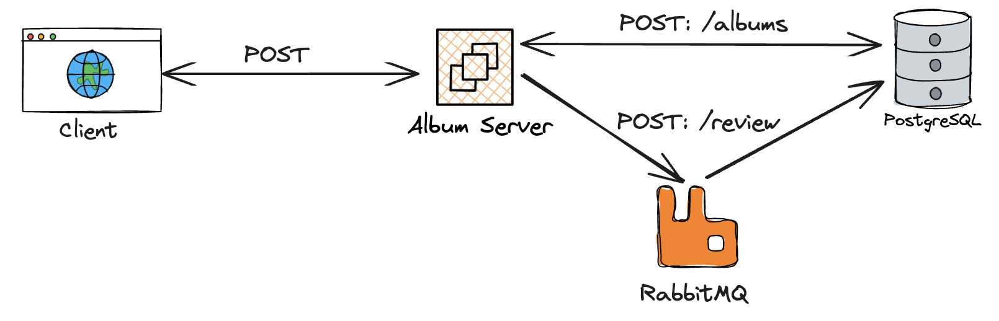
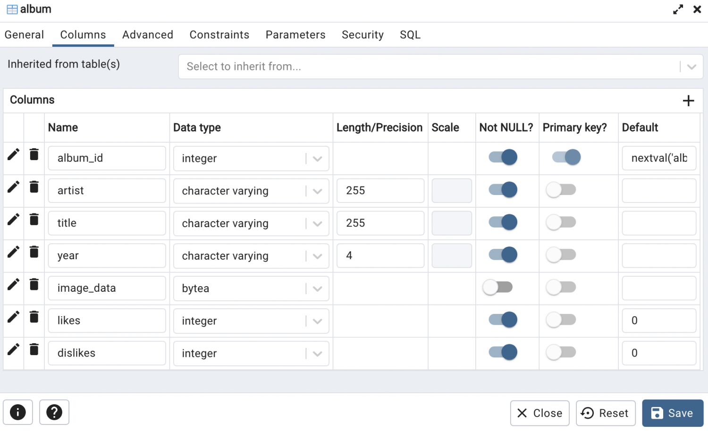
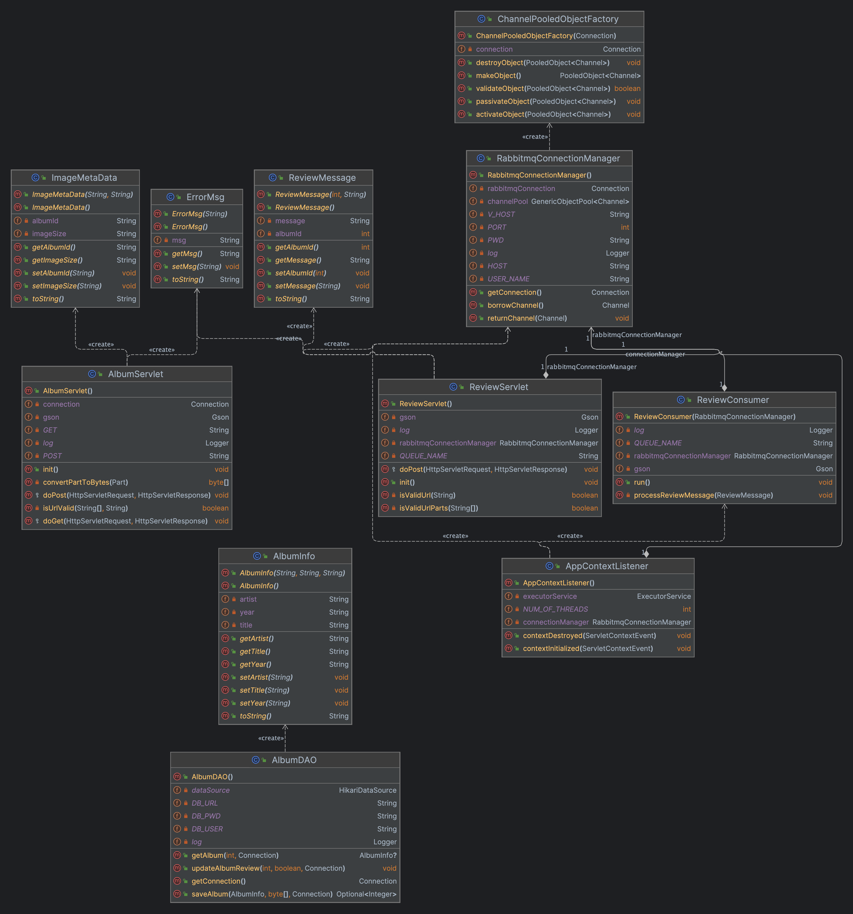
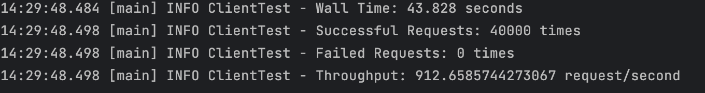
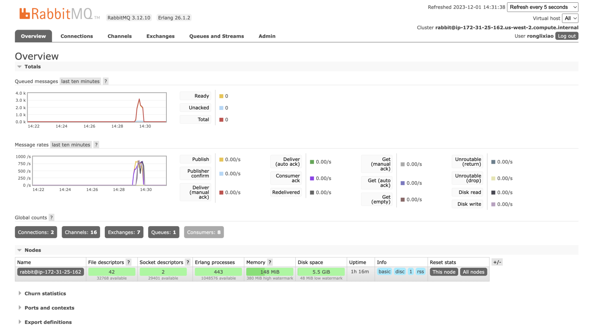
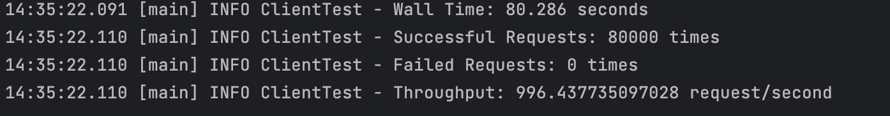
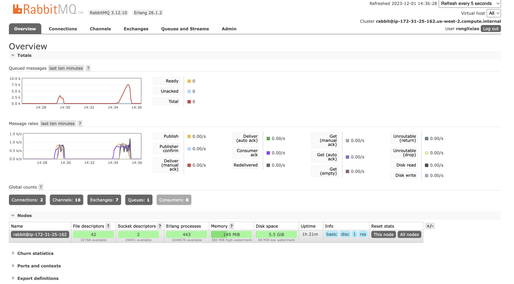
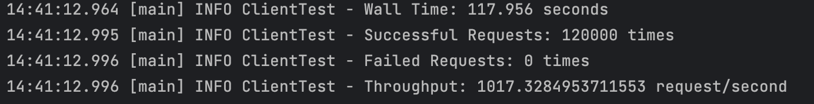
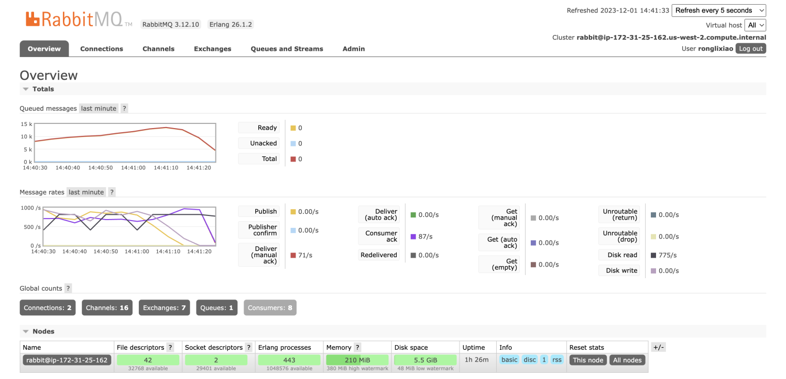
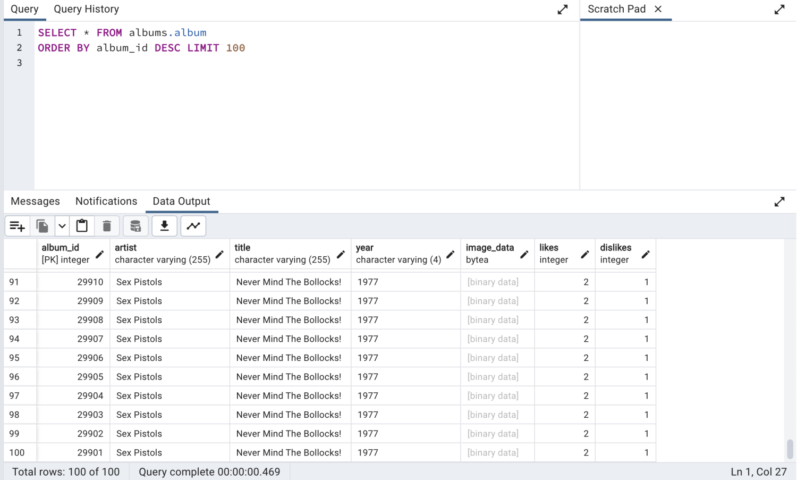

# CS6650-Assignment3 - Xiaorui Shen

## Architecture

1. **Client**: The client initiates the process by sending a POST request to the Album Server. This request is intended to either add new album data or a new album review.
2. **Album Server**: Upon receiving a POST request, the Album Server processes the data. Depending on the endpoint specified in the request, it directs the data to two different services:
   - `POST: /albums`: If the request is directed to the `/albums` endpoint, the Album Server forwards the data to a PostgreSQL database, where album information is stored.
   - `POST: /review`: If the request targets the `/review` endpoint, it indicates a new review submission, which the Album Server sends to RabbitMQ, a message broker.
3. **PostgreSQL**: This database system receives album data from the Album Server and persists it in the relevant tables.
4. **RabbitMQ**: This message broker queues review data for processing, which can be consumed by other services in the architecture for various purposes, such as analytics, notifications, or further processing.

## Database

### Configuration

- Image size: 3575 bytes (original size)
- Database: AWS RDS PostgreSQL Instance
- Class: db.t3.micro
- RAM: 1GB
- vCPU: 2

### Data model update

single album table:

- `album_id`: A unique auto-incrementing identifier for each album entry, marked as the primary key.
- `artist`: The name of the music artist, which is required for each album.
- `title`: The album title, also a required field.
- `year`: The release year of the album, stored as text but required.
- `image_data`: Binary data for the album’s cover image, optional for each entry.
- `likes`: This field represents the number of likes the album has received. It is an important metric for gauging the album's popularity and reception among listeners. 
- `dislikes`: Similar to `likes`, this column indicates the number of dislikes for the album. It provides an insight into the album's reception from a different perspective, allowing for a more nuanced understanding of listener opinions. 

## Server

The server architecture is designed to efficiently handle album data management and user review processing. This document outlines the major classes and packages, their relationships, and the message flow for sending and receiving data within the server.

### Dependencies

- **SLF4J API (`slf4j-api`)**: Provides an abstraction for logging frameworks.
- **Logback Classic (`logback-classic`)**: Serves as the implementation for the SLF4J logging.
- **Servlet API (`javax.servlet-api`)**: Defines the servlet interface for HTTP request and response handling.
- **Lombok (`lombok`)**: Automates Java boilerplate code, like getters, setters, and more.
- **Gson (`gson`)**: Converts Java Objects into JSON and back.
- **HikariCP (`HikariCP`)**: Manages SQL database connection pooling.
- **PostgreSQL Driver (`postgresql`)**: Facilitates connectivity to PostgreSQL databases.
- **RabbitMQ Client (`amqp-client`)**: Enables interaction with RabbitMQ for messaging.
- **Commons Pool (`commons-pool2`)**: Provides generic object pooling capabilities.

### Major Classes

1. **Servlets**
   - `AlbumServlet`: Manages HTTP requests for albums. It supports operations like creating a new album (POST) and retrieving album data (GET).
   - `ReviewServlet`: Handles HTTP requests for reviews. It facilitates the posting of user reviews and interacts with RabbitMQ to enqueue messages.
2. **RabbitMQ Integration**
   - `RabbitmqConnectionManager`: Manages RabbitMQ connections, ensuring optimal connection use and reducing overhead by pooling channel instances.
   - `ReviewConsumer`: Subscribes to a RabbitMQ queue, consumes messages that contain review data, and updates the database based on the message content.
3. **Data Access Objects (DAOs)**
   - `AlbumDAO`: Communicates with the database to perform CRUD operations related to albums.
   - Utilizes `HikariDataSource` for efficient connection pooling and database interaction.
4. **Data Models**
   - `AlbumInfo`: Holds album-related data such as artist name, album title, and year of release.
   - `ReviewMessage`: Represents a review message with fields for `albumId` and the review type ("like" or "dislike").
   - `ImageMetaData`: Contains metadata for album images, such as image format and size.
   - `ErrorMsg`: Used to construct and convey error messages within the server.
5. **Utilities**
   - `ChannelPooledObjectFactory`: Creates and manages pooled objects for RabbitMQ channels, enhancing resource management.
   - `AppContextListener`: Listens to the context events of the server, handling initialization and cleanup tasks for resources like the `ExecutorService` and connection managers.

### Relationships and Interactions

- The `AlbumServlet` and `ReviewServlet` are the entry points for HTTP requests, interfacing with the client-side applications.
- `AlbumServlet` utilizes `AlbumDAO` for database operations, directly affecting the PostgreSQL database where album information is stored.
- `ReviewServlet` communicates with `RabbitmqConnectionManager` to send messages to RabbitMQ whenever a new review is posted.
- `ReviewConsumer` continuously listens to a RabbitMQ queue and, upon receiving a message, parses it into a `ReviewMessage` object and updates the database's "likes" or "dislikes" fields accordingly.
- All data model classes (`AlbumInfo`, `ReviewMessage`, `ImageMetaData`, `ErrorMsg`) are utilized by servlets and DAOs to handle and transfer data throughout the server's processes.

### Message Flow

1. When a client submits a review:
   - The `ReviewServlet` receives a POST request containing the review.
   - It validates the request and uses `RabbitmqConnectionManager` to send the review message to RabbitMQ.
2. For album-related requests:
   - `AlbumServlet` receives GET or POST requests.
   - For GET, it retrieves album data using `AlbumDAO`.
   - For POST, it creates a new album record in the database via `AlbumDAO`.
3. The `ReviewConsumer`:
   - Listens to the RabbitMQ queue and processes incoming review messages.
   - Extracts the `albumId` and sentiment from the message.
   - Calls `AlbumDAO` to update the "likes" or "dislikes" counter for the specified `albumId` in the database.

## Test results

### 1. Test 1 (threadGroupSize = 10, numThreadGroups = 10, delay = 2):

### 2. Test 2 (threadGroupSize = 10, numThreadGroups = 20, delay = 2):

### 3. Test 3 (threadGroupSize = 10, numThreadGroups = 30, delay = 2):

